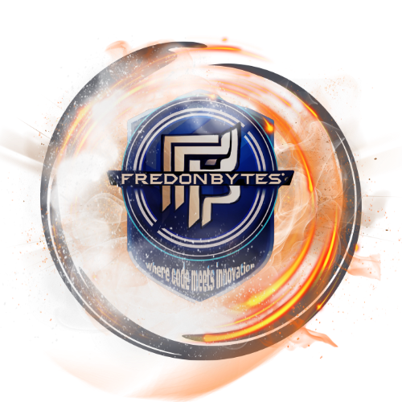

# waybar-menu-fredon

> Modern, blurred, and a little bit sassy menu for Waybar/Hyprland. Because your workflow deserves more than boring popups.

---



## 🚀 Features

- Gorgeous glassy menu for Waybar/Hyprland
- Blurred background (so you can see your wallpaper and your regrets)
- JSON-configurable buttons with icons
- Lightning-fast, minimal dependencies
- ESC/click-outside to close (because you have things to do)
- Sarcastic, developer-friendly docs

## 🛠️ Installation

1. **Clone this repo**

   ```fish
   git clone https://github.com/FredonBytes/waybar-menu-fredon.git
   cd waybar-menu-fredon
   ```

2. **Install dependencies**

   ```fish
   uv venv
   source .venv/bin/activate
   uv pip install -r requirements.txt
   ```

   Or use `pip` if you like to live dangerously.

3. **Copy the module to your config**

   - Place the `waybar-menu-fredon` folder wherever you want (your dotfiles, your cat's home directory, etc).
   - Update your Waybar config to launch the menu:

     ```json
     {
       "custom/menu": {
         "format": "󰍉",
         "on-click": "python /path/to/waybar-menu-fredon/main.py"
       }
     }
     ```

## ⚙️ Configuration

Edit `config/menu-config.json` to add your own buttons, icons, and commands. Example:

```json
{
  "buttons": [
    {
      "name": "Terminal",
      "icon": "assets/icons/terminal.png",
      "command": "alacritty"
    },
    {
      "name": "Browser",
      "icon": "assets/icons/firefox.png",
      "command": "firefox"
    }
  ]
}
```

## 🏃 Running

```fish
python main.py
```

## 🧩 Troubleshooting

- **Menu doesn't show up?**
  - Check your Wayland/Hyprland setup. Set `QT_QPA_PLATFORM=wayland` if needed.
  - Make sure your icons and config paths are correct.
- **Commands not launching?**
  - Check your JSON config. Typos are the #1 cause of existential dread.
- **Blur not working?**
  - Ensure you have the right dependencies and Hyprland supports blur.

## 🤝 Contributing

See [CONTRIBUTING.md](CONTRIBUTING.md). PRs, issues, and memes welcome.

## 📜 License

MIT — see [LICENSE](LICENSE)

## 🏷️ First Release Tag

- Tag your first release:

  ```fish
  git tag v0.1.0
  git push origin v0.1.0
  ```

---

## 👨‍💻 Developer Signature

### Fredon — FredonBytes — Where code meets innovation

#### Et in tenebris codicem inveni lucem

---

> "If you fork this and don't star it, a kitten loses its blur."
